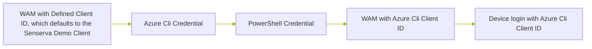
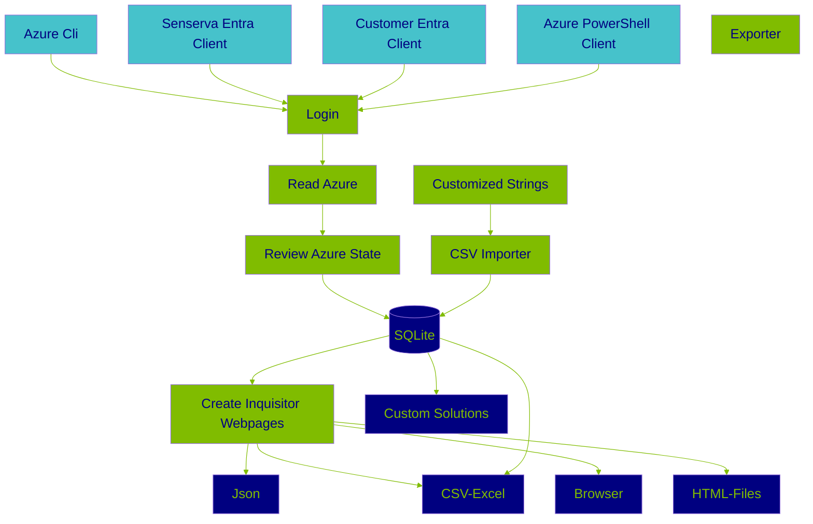
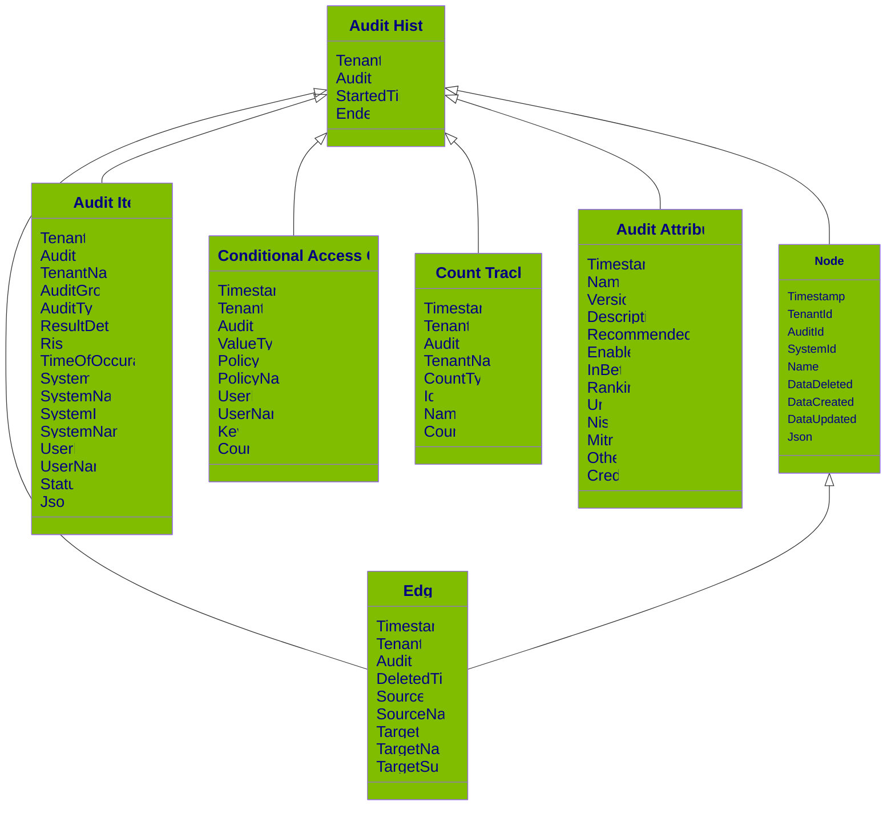

*Know your Entra ID Security State in minutes!*

Welcome! This may be the biggest security tool find of 2025. Use the [Senserva](https://senserva.com) $${\color{LimeGreen}Inquisitor}$$ to just look for top issues or drill deep on the state of each Entra ID you manage, the data and interface support both. You can also easily edit the content of the $${\color{LimeGreen}Inq.exe}$$ user interface or create your own.  We support Microsoft Excel, Json and relational databases. There can be a lot of data if you are running in "Info" mode.  The $${\color{LimeGreen}Inq.exe}$$ scanner is a command line tool and can be used stand-alone, it also builds a local web page  you can interact with after a scan.  $${\color{LimeGreen}Inq.exe}$$ also provides an extensive set of web page based information for easier review, or you can create your own UI.  $${\color{LimeGreen}Inq.exe}$$ compliments our Drift management product.

# $${\color{LimeGreen}The} {\color{LimeGreen}Senserva} {\color{LimeGreen}Inquisitor}$$
This is **Beta 1** of the $${\color{LimeGreen}Inquisitor}$$ and can be used by either IT teams or Security teams to do quick or depth security reviews.  This release is for Windows, Linux Container version coming in a not too distant release.

> # Why We Created $${\color{LimeGreen}Inq.exe}$$
> 
>  -  Mark [Shavlik](https://en.wikipedia.org/wiki/Shavlik_Technologies), CEO of Senserva, here, $${\color{LimeGreen}The} {\color{LimeGreen}Senserva} {\color{LimeGreen}Inquisitor}$$ is designed to be an advanced and widely used open source and free security and IT auditor and manager, with remediation, for physical, virtual and Cloud systems. Its goal is to be usable by any level of user, from IT or Security. Its first installment is focused on Azure Entra ID. We are creating $${\color{LimeGreen}Inquisitor}$$ with the goal of building a team of industry leaders to work with us, right now the source code will be restricted to that group until it is ready for release.  Please let us know at Info at Senserva if you want to join in, as we have a great team going already.  As background, I wrote my first Windows NT scanner for 3M Corporation in 1994, shortly after leaving the Windows NT Dev Team in Redmond.  I sold that to George Kurtz and Foundstone. I then wrote the patch system called [HFNetChk](https://www.itprotoday.com/devops/hfnetchk-microsoft-s-new-hotfix-tool) and [MBSA](https://www.microsoft.com/en-us/security/blog/2012/10/22/microsoft-free-security-tools-microsoft-baseline-security-analyzer/) (working with Microsoft), which is also the root of WSUS.  These things help secure millions of computers. I sold that company, Shavlik Technologies, to VMware and soon after started writing scanners for Microsoft Azure, including the Advanced Drift Management in Senserva's main product. Note that $${\color{LimeGreen}Inquisitor}$$ compliments our propritary Drift automation product. We are happy to work with others on this as well. Thanks! - Mark

> # Quick  View
> 

> # $${\color{LimeGreen}Inq.exe}$$ Use Cases
  * Quick security checks, just look for high level issues. 
  * Recurring deep review, dig into the data to look for trends. Replaces need to call APIs or KQL by hand.
  * Monitor configuration drift across a wide varity of security products (Future)
  * Conditional Access Rules and Usage - dig deep in to CA, see what rules are used, not used, will never be used and more
  * Replace existing scripts and grab data from the Inquisitor SQL database or generated CSV files
  * Inquisitor can be run over and over, it only records changes so it is very efficent

  > [!IMPORTANT]  
 >⭐ Please Star/Follow/Watch us on GitHub — it motivates all of us! And it keeps you informed about changes as well. (Thank you!!)  We also want your input so please files Issues for any questions or input.

# ⚡️ $${\color{LimeGreen}Inquisitor}$$ Just Run It

Download $${\color{LimeGreen}Inq.exe}$$ to get started, with a double click or a clone, and enter inq.exe . $${\color{LimeGreen}Inq.exe}$$ has a digital signature so your AV should be OK with it. If not please let us know right away.  We do not currently support any Github zip file or release downloads. Click on the Inq.exe and find the download button or clone the repository.

> [!TIP]
> No Installation Needed! $${\color{LimeGreen}Inquisitor}$$ Self installs in the current directly, and  you can remove everything by deleting that directory.

You do not have to register, log in or do anything other than review, agree to and follow our [EULA](https://github.com/Senserva-LLC/Senserva-Inquisitor/blob/main/EULA.html). Delete the installation directory and $${\color{LimeGreen}Inq.exe}$$ gone, it only uses the installation directory. You may be asked to use the Demo Senserva Entra ID Application, if you use it to see if you like Inq.exe be sure to delete it after its first usage and make your own version, then secure it so you control who has access to it.  We provide the Demo just to make it easy to do initial evaluations of Beta 1.

> [!IMPORTANT]  
> The Graph API claims Global Reader or Security Reader Entra ID Rights are needed to get data. This is true, but not always it seems.  But to do a full scan enable either Global Reader or Security Reader.  We strongly suggest using PIM and setting a short window on these rights.
>
> [!IMPORTANT]  
> The INQ.EXE has been digitally signed by us, and co-signed by Microsoft. In spite of this, some anti-virus software may flag it for attention and quarentine the app, both at download and possibly later at runtime. Consult your AV software documentation for instructions on how to green-flag the app. TIP - When looking at the app in the Windows file manager, the correct app will have a green Senserva 'S' as a logo. A placeholder file generated by AV software will not.

The Senserva $${\color{LimeGreen}Inquisitor}$$ (aka $${\color{LimeGreen}Inq.exe}$$) has many options and ways to work with, but things can come as you learn more about $${\color{LimeGreen}Inq.exe}$$. $${\color{LimeGreen}Inq.exe}$$ installs itself, just run it and the first time it will create the database and browser files it needs in the directory you are running in.  That's it, $${\color{LimeGreen}Inq.exe}$$ will figure things on its own from there. By default $${\color{LimeGreen}Inq.exe}$$ trys various logins automaticly to find the best one for you. Or you can select your login mode with a parameter.

> [!TIP]
> Start with the quick start and take the defaults.  Let $${\color{LimeGreen}Inq.exe}$$ do the initial heavy lifting. Then after a few usages start looking deep into the data. The $${\color{LimeGreen}Inq.exe}$$ data is tagged with levels such as High Risk, or just Informational. You can filter the data in the UI to quickly learn your state.  You can run with any user rights to see what data you get back, but Security Reader or Global Reader work best.

# 🚀 Key $${\color{LimeGreen}Inquisitor}$$ Features
* There are no servers used. No web servers, no database severs. None.  Yet there is a full relational database thanks to SQLite and rich web pages based on html files local to the inq.exe directly to review results. This is done by design, to keep the data local and to keep it simple on the outside but very advance do the inside.
* Just download the Signed Inq.exe and go, setup is complete automated. 
* Each time you run an scan only changes are recorded in the database.  You can run inq.exe all you want and only new data is saved.
* Easy to login to Azure, including Zero setup options.
* It is easy to share data with others. Inq.exe runs in two modes, audit mode which requires an Azure Login and Reporting mode which can be run by anyone.
* Built to be customized. The database and user interface can be easily accessed and customized from multiple platforms to create custom monitors and reports.
* The User interface can export Json with user interface search and filter dials that enable it to be broad or specific data. 
* Output text can be easily customized via auto-generated CSV files that are used to display all key text.
* Full leveled logging to auto-rolling files support, makes it easy to understand what is going on inside Inq.exe.
* Trends stored in the data. $${\color{LimeGreen}Inquisitor}$$ data is deduped and contains a history.  So, it does not grow too large, but at the same time you can observe changes over time.
* Source code available
* 
# 🌟 What $${\color{LimeGreen}Inquisitor}$$ Manages in this Release
* Extensive Audit and Monitoring
  * Directory Logs
  * Signin Logs
  * Conditional Access Rules and Usage
  * Users
* Basic Audit, used by Conditional Access Review
  * Service Principals
  * Devices
  * Groups
  * Roles
  * Risky Users
  * Risk Detections
* Next
  * More Audit and Monitoring for Service Principal Audit, Groups Audit, Roles, Risky Users, Risk Detections
  * Add
    * Secure Score Audit and Monitoring
    * Drift Monitoring
    * Service Principal Risk Detections Audit and Monitoring
    * Risky Service Principals Audit and Monitoring
    * PIM Audit and Monitoring
      
# 🛠️ How $${\color{LimeGreen}Inquisitor}$$ Works

$${\color{LimeGreen}Inquisitor}$$ runs scans on demand, with scheduling and Containers coming in a future beta.

## Getting Credentials

$${\color{LimeGreen}Inquisitor}$$ uses [Web Account Manager (WAM)](https://learn.microsoft.com/en-us/entra/identity-platform/scenario-desktop-acquire-token-wam) and [The Azure Identity Library](https://learn.microsoft.com/en-us/dotnet/api/overview/azure/identity-readme?view=azure-dotnet). 

### Defaults to -- auto
If no parameters are used the default is --auto, a mode that selects the best login for you.

#### Commandline Parameters

> [!TIP]
> If you are using Azure CLI login with that to start out.  It is easy, you have nothing to do. Over time you may want to create your own Entra ID Client to get all the rights $${\color{LimeGreen}Inquisitor}$$ is able to take advanage of.

## How $${\color{LimeGreen}Inquisitor}$$ uses User Rights.

#### The Senserva Demo Entra ID Application

Scope = ["UserAuthenticationMethod.Read", "IdentityRiskEvent.Read.All", "IdentityRiskyServicePrincipal.Read.All", "IdentityRiskyUser.Read.All", "AuditLog.Read.All", "Policy.Read.All", "User.Read.All", "Directory.Read.All", "Policy.Read.ConditionalAccess"];

#### The Azure CLI

Scope = ["AuditLog.Read.All", "Directory.AccessAsUser.All", "Group.Read.All", "User.Read.All"];

The Azure Command-Line Interface (CLI) connects to Azure and execute administrative commands on Azure resources. It caches credentials and $${\color{LimeGreen}Inquisitor}$$ reads taht cache to log you in if you requst it. [Azure CLI](https://learn.microsoft.com/en-us/cli/azure/what-is-azure-cli)

#### The Az PowerShell Module

Note Beta 1 is not reliable for this, at  least in our testing. It may work for you as we believe we are calling everything correctly.

Scope =  ["AuditLog.Read.All", "Directory.AccessAsUser.All"];

The Az PowerShell module is a set of cmdlets for managing Azure resources directly from PowerShell. [The Az PowerShell Module](https://learn.microsoft.com/en-us/powershell/azure/new-azureps-module-az?view=azps-13.0.0)

#### Customer EntraID Client

Based this Senserva's but make your own, using the rights you wish to use. Be sure to secure it so you control who runs it.  $${\color{LimeGreen}Inquisitor}$$ will only scan for the items can access so include the roles you want to include.  Note you may be surprised at what you can see.

## $${\color{LimeGreen}Inquisitor}$$ In Action

## Logging

$${\color{LimeGreen}Inquisitor}$$ has detailed logging, stored in the Log subdirectory.  The scan $${\color{LimeGreen}Inquisitor}$$ will show select data so you can easily monitor progress, but all the data on the the UI and much more will be in the logs.  

Logs/SenservaLogFile20250116 is an example log name.  The numbers break out to the year and the day, and the logs have automatic roll over so they stay managable.

A quick review of the logs gives you an indepth review of what $${\color{LimeGreen}Inquisitor}$$ is doing, or the issues may have.

*  ...
*  2025-01-16 11:40:36.307 -06:00 [INF] Senserva.Scanner.AuditManager  Senserva "EntraSigninLogs" AuditCompleted
*  2025-01-16 11:40:36.310 -06:00 [INF] Senserva.Scanner.AuditManager  Senserva "Devices" EnableAudit
*  2025-01-16 11:40:38.795 -06:00 [INF] Senserva.Scanner.AuditManager  Senserva "Devices" AuditCompleted
*  2025-01-16 11:40:38.894 -06:00 [INF] Senserva.Scanner.AuditManager  Senserva "RiskyUsers" EnableAudit
*  2025-01-16 11:41:03.604 -06:00 [ERR] Senserva.Scanner.SenservaGraph  Senserva "SignInPreferences" Request Authorization failed
*  ...

## Working with the Results

There are multiple ways to work with the results from $${\color{LimeGreen}Inquisitor}$$

* Using our advance UI to work with the data, sort it, filter and export it
* Export the data to CSV and us Microsoft Excel to work with the data
* Export Json from the UI and create you own views with your viewing tools
* Directly access the database with your own application, possibly in Python

## Logic and Dataflow

By default CSV files create are Audit.csv (Clean, reviewed), Nodes.csv (Raw Azure data), Edges.csv (connections between Azure data), ConditionalAccessCounts.csv (usage counts), and SigninCounts.csv (extensive log reviews). Users can create their own custom CSV files via the html file based user interface. This data is the same data that is in the database, it is just presented this way so it can be viewed in things like Microsoft Excel.

# $${\color{LimeGreen}Inquisitor}$$ Database

The Senserva $${\color{LimeGreen}Inquisitor}$$ uses a relational database to store results. You can 100% ignore the database if you wish, or you can dig in an create your own reporting.  The data model is basic and after a few runs of Inq.exe it will make sense to you.

> [!NOTE]
> Digging into the Senserva $${\color{LimeGreen}Inq.exe}$$ database is for advanced users who want to create their own front-end to the data, something we encourage as long as license rights are followed.  But - at the same time - we have a great customizable UI out of the box, start there.  You can edit the text via published CSV files if you wish.

## ⚙️ $${\color{LimeGreen}Inquisitor}$$ Integrations

$${\color{LimeGreen}Inquisitor}$$ is built with SQLite. SQLite is a small, fast, self-contained, high-reliability, full-featured, SQL database engine. SQLite is the most used database engine in the world. [More About Sqlite](https://www.sqlite.org/)

It is easy to work with SQLite in Python and other languages. The Python SQLite3 module is used to integrate the SQLite database with Python. There is no need to install this module separately as it comes along with Python after the 2.5x version. [More About Python and Sqlite](https://docs.python.org/3/library/sqlite3.html) 

SQLite can also be used with PowerShell to read Inq.Uisitor data.  [SQLite and PowerShell with SimplySql](https://www.powershellgallery.com/packages/SimplySql/2.0.2.70)

# Easily Extend $${\color{LimeGreen}Inquisitor}$$

## $${\color{LimeGreen}Inquisitor}$$ in Excel

TODO

## $${\color{LimeGreen}Inquisitor}$$ Json Design

TODO show enough Json here to let people know what we do

## $${\color{LimeGreen}Inquisitor}$$ Database Design

This is an quick overview of the main data tables used by Senserva to go give you an idea of the extent of our data.  Use a product like [DB Browser for SQLite](https://sqlitebrowser.org/) to full review the data format and content.  Or contact us we are glad to help.  Our data model is simple and the data is rich, take a peek behind the scenes with the DB Browsers when you get a minute.

You do not need to know the database to run $${\color{LimeGreen}Inq.exe}$$.  These notes are for people who want to create their own customizations. Our tables also contain rich set of Json data as well so is a lot of data you can use to create custom solutions.  Or you can just use our UI, it is pretty good :)

> [!CAUTION]
> Please note that while sharing of Senserva output data easy to do since its in external files, it is important to handle Senserva data with care. Ensure you verify the recipient's identity and always use secure methods for sharing the information.
> 
# Changing Content with the $${\color{LimeGreen}Inq.exe}$$ CSV file

Senserva provides an Excel Compliant file that you can easily edit to control output text.  The file is created after the first run of Inq.exe (the first run includes the install phase). So to use this CSV data just run 2 scans, the 2nd one is fast because we only look for changes since the last scan.      [Checks](https://github.com/Senserva-LLC/Senserva-Inquisitor/blob/main/Senserva.csv)                               

## Web Pages

# $${\color{LimeGreen}Inquisitor}$$ Project Status
Runtimes for Senserva - early beta please contact us for assistance and information. Senserva provides public contains with significant support, and then we add more for partners and customers who work more closely with us. All for free. Source could available to select partners and customers, please check with us.

## ${\color{LimeGreen}Inquisitor}$$ Known Bugs

## 🗺 ${\color{LimeGreen}Inquisitor}$$ Roadmap

* Scheduling
* Remediation
* Containers
* Powershell cmdlets 
* Drift Managent
* Patch Management
    
# 📄 $${\color{LimeGreen}Inq.exe}$$ License
Please review the SenservaLicense file before using this software. And note These run times only for END USER USE ONLY. They cannot be used within other products or be embedded in paid services without Senserva's express written permission. Senserva has an established OEM program with a scalable pricing model that works for companies of all sizes.  Please contact us for use of these, and all our works, as part of your products or to be embedded in your services. Also be sure to read the text around PROVIDED "AS IS" AND WITH ALL FAULTS AND DEFECTS WITHOUT WARRANTY OF ANY KIND.

Please note these run times are not yet ready for use, we are testing out the builds etc.

# 🤝 Contributing

Senserva is growing quickly and we would love more people to get involved in this project. Whether you have ideas to share, bugs to report, or features  you want to see, your contributions are welcome!

# 💡About Senserva

The Senserva team is built with a team Microsoft Security Industry leaders including former Microsoft employees. Senserva believes an essential component of computer security is the efficient application of security tools and automated processes.

We provide straightforward, continuous, and actionable insights into what needs the most immediate attention. Creating guidance on the proper use of Microsoft and other security products for all levels of security skills and driving the management of those insights.

Senserva, an ISV member of the exclusive Microsoft Intelligent Security Association (MISA) and 2024 ISV of the year finalist, was founded by industry leader and Microsoft Security expert, Mark Shavlik, along with TJ Dolan.

 [More About Senserva](https://senserva.com/about)
 

