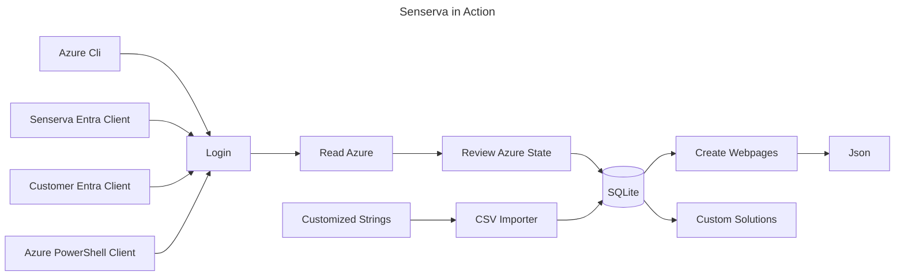
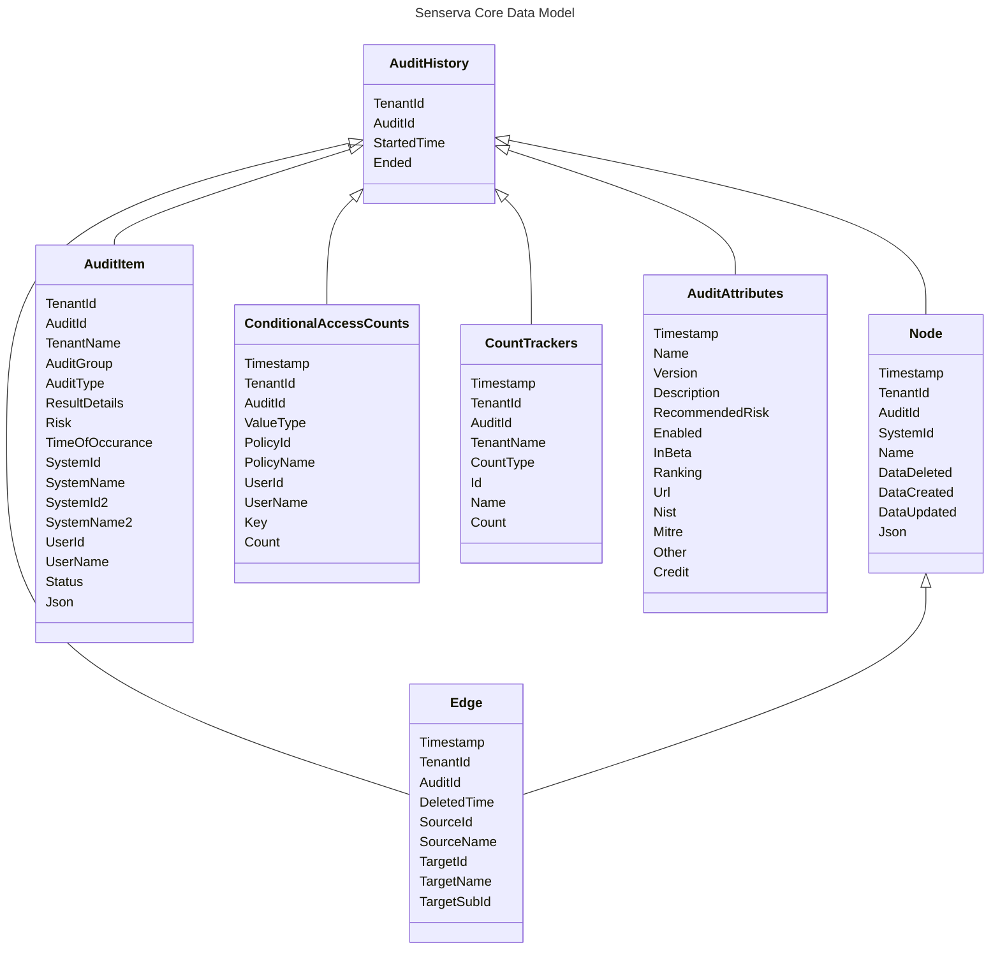

``

# The Senserva Inq.Uisitor

*** Please NOTE this is not yet ready to download, it will be in the next 24 hours ***

This is Beta 1 of the Senserva Inq.Uisitor, a free product designed to make it easy to know the security state of all the Entra IDs a technical team supports.  Inq.exe can be used by either IT teams or Security teams.  You can just look for top issues or you can drill deep on the the state of each Entra ID you manage, the data and interface support both. You can also easliy edit the content of the Inq.exe user interface or create your own.

Senserva built this product to automate its own use of Entra ID, conditional access usage, log monitoring and configuration drift management.  As we showed to more people we realized our best next step is to make it freely available.  

Inq.Uisitor, or inq.exe, runs out of the box, sets itself up automatically and creates a rich set of interactive web pages.  It also has a broad set of parameters and CSV files to neable customizatoins. Inq.exe uses a local SQL database (server less SQLIte) to store data.  This database can be used to easily create custom reports.

Please see our the [Inq.exe Wiki](https://github.com/Senserva-LLC/Senserva-Runtime/wiki) for more Detailed Screen Shots and Data Examples.

⭐ Please Star us on GitHub — it motivates all of use! (Thank you!!)  Follow us too, there are frequent updates.

# Key Features

* There are no servers used. No web servers, no database severs. None.  Yet there is a full releational database thanks to SQLite and rich web pages based on html files local to the inq.exe directly to review results. This is done by design, to keep the data local and to keep it simple on the outside but very advance do the inside.
* Just download the Signed Inq.exe and go, setup is complete automated. 
* Each time you run an scan only changes are recorded in the database.  You can run inq.exe all you want and only new data is saved.
* Easy to login to Azure, including Zero setup options.
* It is easy to share data with others. Inq.exe runs in two modes, audit mode which requires an Azure Login and Reporting mode which can be run by anyone.
* Built to be customized. The database and user interface can be easly accessed and customized from multiple platforms to create custom monitors and reports.
* The User interface can export Json with user interface search and filter dials that enable it to be broad or specific data. 
* Output text can be easily customized via auto-generated CSV files that are used to display all key text.
* Full leveled logging to auto-rolling files support, makes it easy to understand what is going on inside Inq.exe.
* Trends stored in the data. Senserva data is deduped and also contains a history.  So it does not grow too large, but at the same time you can observe changes over time.
* Source code available

# Quick Start

The best thing to do to get started is download Inq.exe with a double click and run it. The Senserva Inq.Uisitor as many options and ways to work with, but things can come as you learn more about Inq.exe.

## Auto Install

 Inq.exe installs itself, just run it and the first time it will create the database and browser files it needs in the directory you are running in.  That's it, Inq.exe will figure things on its own from there.

# How it Works

Inq.Uisitor runs scans on demand, with scheduling and Containers comming in a future beta.

### There are Many Options for Logging into Azure

Inq.exe and many options to login in to Azure.  The easiest way to go is to use the Azure CLI and inq.exe just uses your current login, you do not need to do anything if you are already using the Azure CLI, or you can easily set it up.  The Azure Powershell is also supported

#### The Azure CLI

The best way to start working with Inq.exe. If its already running for you there is nothing to do.  If its not already running its easy to install and login and let Inq.exe take it from there.

The Azure Command-Line Interface (CLI) is a cross-platform command-line tool to connect to Azure and execute administrative commands on Azure resources. It allows the execution of commands through a terminal using interactive command-line prompts or a script. [Azure CLI](https://learn.microsoft.com/en-us/cli/azure/what-is-azure-cli)

#### The Az PowerShell Module

Note Beta 1 is not reliable for this, at  least in our testing. It may work for you.

The Az PowerShell module is a set of cmdlets for managing Azure resources directly from PowerShell. [The Az PowerShell Module](https://learn.microsoft.com/en-us/powershell/azure/new-azureps-module-az?view=azps-13.0.0)

#### The Senserva Demo EntraID Client

Example, list all rights for the full product

#### Customer EntraID Client

based on Senserva's but make your own. This is an advanced usage and it enables the most features

# Senserva Database

The Senserva Inq.Uisitor uses a relational database to store results. You can 100% ignore the database if you wish, or you can dig in an create your own reporting.  The data model is basic and after a few runs of Inq.exe it will make sense to you.

## Senserva Data Level Integrations

Inq.exe is built with SQLite. SQLite is a small, fast, self-contained, high-reliability, full-featured, SQL database engine. SQLite is the most used database engine in the world. [More About Sqlite](https://www.sqlite.org/)

It is easy to work with SQLite in Python and other languages. The Python SQLite3 module is used to integrate the SQLite database with Python. There is no need to install this module separately as it comes along with Python after the 2.5x version. [More About Python and Sqlite](https://docs.python.org/3/library/sqlite3.html) 

SQLite can also be used with Powershell to read Inq.Uisitor data.  [SQLite and PowerShell with SimplySql](https://www.powershellgallery.com/packages/SimplySql/2.0.2.70)

# Creating Custom Reporting

## Senserva's Data Design

This is an quick overview of the main data tables used by Senserva to go give you an idea of the extent of our data.  Use a product like [DB Browser for SQLite](https://sqlitebrowser.org/) to full review the data format and content.  Or contact us we are glad to help.  Our data model is simple and the data is rich, take a peek behind the scenes with the DB Browsers when you get a minute.

You do not need to know the database to run Inq.exe.  These notes are for people who want to create their own customizations. Our tables also contain rich set of Json data as well so is a lot of data you can use to create custom solutions.  Or you can just use our UI, it is pretty good :)

## Changing Content with the Senserva CSV file

## Web Pages

# Project Status
Runtimes for Senserva - early beta please contact us for assistance and information. Senserva provides public contains with signifigant support, and then we add more for partners and customers who work more closely with us. All for free. Source could available to select partners and customers, please check with us.

## Known Bugs

## What is Coming Next

* Scheduling
* Inq.exe in Containers
* Inq.exe in Powershell CommandLets

## FAQ

* Hobby 1
  * Nested Hobby 1
    * Sub-nested Hobby 1
* Hobby 2
* Hobby 3

# Desired Collaboration

Please post issues.

# Beta 1 Release Notes

# Recomendations

Senserva supports many types of login techniques, but the easiest way to get start is with the Azure Cli. [https://github.com/MicrosoftDocs/azure-docs-cli/blob/main/docs-ref-conceptual/install-azure-cli-windows.md](https://learn.microsoft.com/en-us/cli/azure/install-azure-cli) or https://learn.microsoft.com/en-us/dotnet/azure/install-azure-cli 

# How to Uninstall Azure PowerShell Modules (it's not supported)

https://learn.microsoft.com/en-us/powershell/azure/uninstall-az-ps?view=azps-13.0.0

https://github.com/Azure/azure-sdk-for-net/blob/main/sdk/identity/Azure.Identity/TROUBLESHOOTING.md#troubleshoot-azurepowershellcredential-authentication-issues

# Usage Rights
Please review the SenservaLicnese file before using this software. And note These run times only for END USER USE ONLY. They cannot be used within other products or be embedded in paid services without Senserva's express written permission. Senserva has an established OEM program with a scalable pricing model that works for companies of all sizes.  Please contact us for use of these,and all our works, as part of your products or to be embedded in your services. Also be sure to read the text around PROVIDED "AS IS" AND WITH ALL FAULTS AND DEFECTS WITHOUT WARRANTY OF ANY KIND.

Please note these run times are not yet ready for use, we are testing out the builds etc.

# About Senserva

The Senserva team is built with a team Microsoft Security Industry leaders including former Microsoft employees. Senserva believes an essential component of computer security is the efficient application of security tools and automated processes.

We provide straightforward, continuous, and actionable insights into what needs the most immediate attention. Creating guidance on the proper use of Microsoft and other security products for all levels of security skills and driving the management of those insights.

Senserva, an ISV member of the exclusive Microsoft Intelligent Security Association (MISA) and 2024 ISV of the year finalist, was founded by industry leader and Microsoft Security expert, Mark Shavlik, along with TJ Dolan.

 [More About Senserva](https://senserva.com/about)
 
# Install

Please do not use any related zip files on this repository.  Just grab the inq.exe, its signed so double check that first.

These are runtimes only, source available upon request and approval by Senserva.

These run times do not require and services, cloud or otherwise.  The run local and the data stays local.  Web page UI runs off local data, the database is a no server SQLite database. 

There are 3 components, the Inquisitor that reads tenants and puts audit data into a SQlite database.  The Senserva Report Generator reads the database and creates local web files for you to view.  The Senserva Remediator will correct things based on your rules (release coming in a future beta)

There is no setup, just download and go.  No servers and no data leaves your device.

Please Read our terms of use https://senserva.com/senserva-terms-of-use

Usage of SenservaInquisitor.  Run SenservaInquisitor -help after downloading.

 
