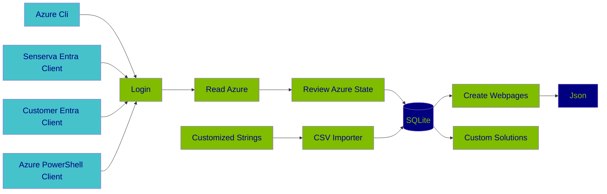
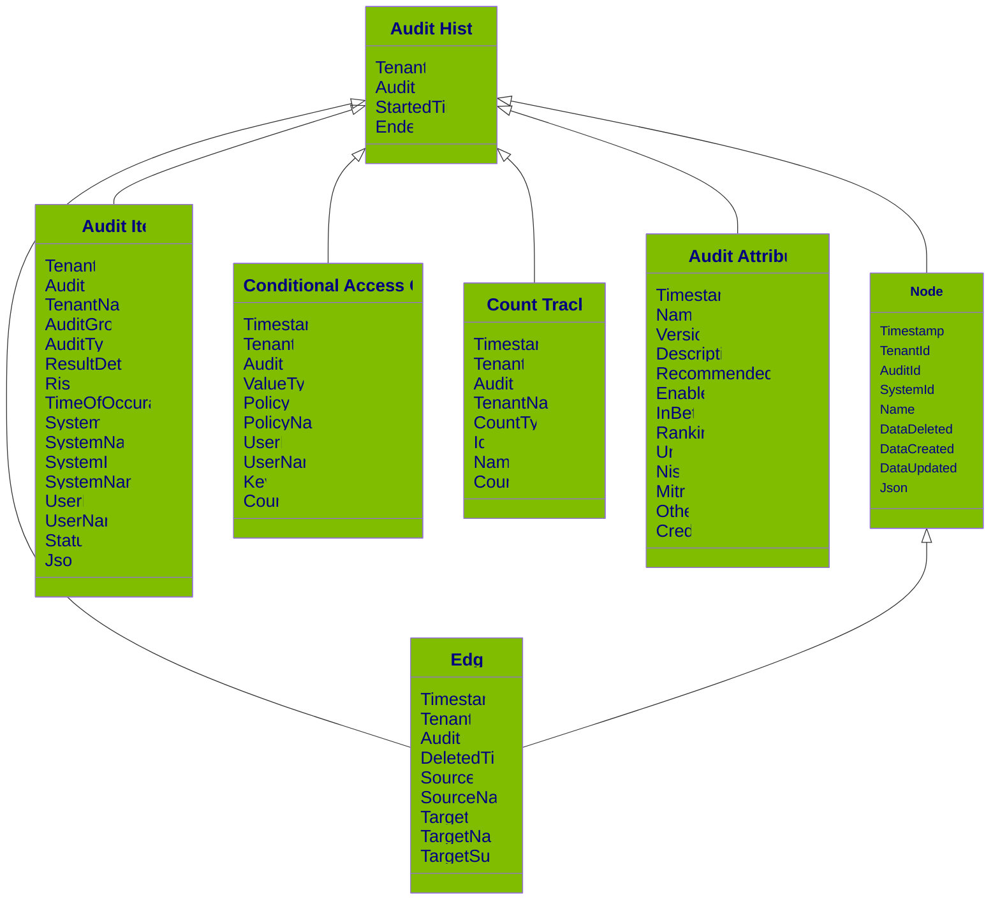

# Know your Entra ID Security State in minutes! No Setup Needed with The $${\color{LimeGreen}Senserva} {\color{LimeGreen}Inquisitor}$$

> [!WARNING]
> *** Please NOTE this is not yet ready to download, it will be in the next 24 hours ***

This is **Beta 1** of the $${\color{LimeGreen}Senserva Inquisitor}$$, a free product designed to make it easy to know the security state of all the Entra IDs a technical team supports.  $${\color{LimeGreen}Inq.exe}$$ can be used by either IT teams or Security teams.  

You can just look for top issues or you can drill deep on the state of each Entra ID you manage, the data and interface support both. You can also easily edit the content of the  $${\color{LimeGreen}Inq.exe}$$ user interface or create your own.

⭐ Please Star us on GitHub — it motivates all of use! (Thank you!!) Follow us too, there are frequent updates.

> [!IMPORTANT]
> **This is Beta 1, it will return great data, but it may not always be accurate.  We need feedback. Please create Issues for all requests. Thank you - the Senserva Team. **

# ✨ $${\color{LimeGreen}Inquisitor}$$ Quick Start

The best thing to do to get started is download $${\color{LimeGreen}Inq.exe}$$ with a double click and run it. It has a digital signature so your AV should be OK with it. If not please let us know right away.

The Senserva $${\color{LimeGreen}Inquisitor}$$ (aka $${\color{LimeGreen}Inq.exe}$$) as many options and ways to work with, but things can come as you learn more about $${\color{LimeGreen}Inq.exe}$$. $${\color{LimeGreen}Inq.exe}$$ installs itself, just run it and the first time it will create the database and browser files it needs in the directory you are running in.  That's it, $${\color{LimeGreen}Inq.exe}$$ will figure things on its own from there.

> [!TIP]
> Start with the quick start and take the defaults.  Let $${\color{LimeGreen}Inq.exe}$$ do the initial heavy lifting. Then after a few usages start looking deep into the data.

# 🚀 Key $${\color{LimeGreen}Inquisitor}$$ Features
* There are no servers used. No web servers, no database severs. None.  Yet there is a full relational database thanks to SQLite and rich web pages based on html files local to the inq.exe directly to review results. This is done by design, to keep the data local and to keep it simple on the outside but very advance do the inside.
* Just download the Signed Inq.exe and go, setup is complete automated. 
* Each time you run an scan only changes are recorded in the database.  You can run inq.exe all you want and only new data is saved.
* Easy to login to Azure, including Zero setup options.
* It is easy to share data with others. Inq.exe runs in two modes, audit mode which requires an Azure Login and Reporting mode which can be run by anyone.
* Built to be customized. The database and user interface can be easily accessed and customized from multiple platforms to create custom monitors and reports.
* The User interface can export Json with user interface search and filter dials that enable it to be broad or specific data. 
* Output text can be easily customized via auto-generated CSV files that are used to display all key text.
* Full leveled logging to auto-rolling files support, makes it easy to understand what is going on inside Inq.exe.
* Trends stored in the data. $${\color{LimeGreen}Inquisitor}$$ data is deduped and contains a history.  So, it does not grow too large, but at the same time you can observe changes over time.
* Source code available

# 🌟 $${\color{LimeGreen}Inquisitor}$$ What We Manage

* Extensive Audits
  * Directory Logs
  * Signin Logs
  * Conditional Access Rules and Usage
  * Users
* Basic Audits
  * Service Principals
  * Devices
  * Groups
  * Roles
  * Risky Users
  * Risk Detections
* Next
  * More ServicePrincipalAudit, GroupsAudit, Roles, Risky Users, Risk Detections
  * Add
    * SecureScoreAudit
    * ServicePrincipalRiskDetectionsAudit
    * RiskyServicePrincipalsAudit
    * PimAudit
  

# 🛠️ How $${\color{LimeGreen}Inquisitor}$$ Works

$${\color{LimeGreen}Inquisitor}$$ runs scans on demand, with scheduling and Containers coming in a future beta.

## Getting Credentionals

### There are Many Options for Logging into Azure

$${\color{LimeGreen}Inq.exe}$$ and many options to login in to Azure.  The easiest way to go is to use the Azure CLI and $${\color{LimeGreen}Inq.exe}$$ just uses your current login, you do not need to do anything if you are already using the Azure CLI, or you can easily set it up.  The Azure PowerShell is also supported.

> [!TIP]
> If you are using Azure CLI login with that to start out.  It is easy, you have nothing to do. Over time you may want to create your own Entra ID Client to get all the rights Inq.exe is able to take advanage of.

## How $${\color{LimeGreen}Inquisitor}$$ uses User Rights. TODO

#### The Azure CLI

The best way to start working with $${\color{LimeGreen}Inq.exe}$$. If its already running for you there is nothing to do.  If its not already running its easy to install and login and let Inq.exe take it from there.

The Azure Command-Line Interface (CLI) is a cross-platform command-line tool to connect to Azure and execute administrative commands on Azure resources. It allows the execution of commands through a terminal using interactive command-line prompts or a script. [Azure CLI](https://learn.microsoft.com/en-us/cli/azure/what-is-azure-cli)

#### The Az PowerShell Module

Note Beta 1 is not reliable for this, at  least in our testing. It may work for you as we believe we are calling everything correctly.

The Az PowerShell module is a set of cmdlets for managing Azure resources directly from PowerShell. [The Az PowerShell Module](https://learn.microsoft.com/en-us/powershell/azure/new-azureps-module-az?view=azps-13.0.0)

#### The Senserva Demo EntraID Client

Example, list all rights for the full product

#### Customer EntraID Client

based on Senserva's but make your own. This is an advanced usage and it enables the most features

## $${\color{LimeGreen}Inquisitor}$$ In Action

# $${\color{LimeGreen}Inquisitor}$$ Database

The Senserva $${\color{LimeGreen}Inquisitor}$$ uses a relational database to store results. You can 100% ignore the database if you wish, or you can dig in an create your own reporting.  The data model is basic and after a few runs of Inq.exe it will make sense to you.

> [!NOTE]
> Digging into the Senserva $${\color{LimeGreen}Inq.exe}$$ database is for advanced users who want to create their own front-end to the data, something we encourage as long as license rights are followed.  But - at the same time - we have a great customizable UI out of the box, start there.  You can edit the text via published CSV files if you wish.

## ⚙️ $${\color{LimeGreen}Inquisitor}$$ Integrations

$${\color{LimeGreen}Inquisitor}$$ is built with SQLite. SQLite is a small, fast, self-contained, high-reliability, full-featured, SQL database engine. SQLite is the most used database engine in the world. [More About Sqlite](https://www.sqlite.org/)

It is easy to work with SQLite in Python and other languages. The Python SQLite3 module is used to integrate the SQLite database with Python. There is no need to install this module separately as it comes along with Python after the 2.5x version. [More About Python and Sqlite](https://docs.python.org/3/library/sqlite3.html) 

SQLite can also be used with PowerShell to read Inq.Uisitor data.  [SQLite and PowerShell with SimplySql](https://www.powershellgallery.com/packages/SimplySql/2.0.2.70)

# $${\color{LimeGreen}Inquisitor}$$ Custom Reporting

## $${\color{LimeGreen}Inquisitor}$$ Data Design

This is an quick overview of the main data tables used by Senserva to go give you an idea of the extent of our data.  Use a product like [DB Browser for SQLite](https://sqlitebrowser.org/) to full review the data format and content.  Or contact us we are glad to help.  Our data model is simple and the data is rich, take a peek behind the scenes with the DB Browsers when you get a minute.

You do not need to know the database to run $${\color{LimeGreen}Inq.exe}$$.  These notes are for people who want to create their own customizations. Our tables also contain rich set of Json data as well so is a lot of data you can use to create custom solutions.  Or you can just use our UI, it is pretty good :)

> [!CAUTION]
> Please note that while sharing of Senserva output data easy to do since its in external files, it is important to handle Senserva data with care. Ensure you verify the recipient's identity and always use secure methods for sharing the information.
> 
# Changing Content with the $${\color{LimeGreen}Inq.exe}$$ CSV file

Senserva provides an Excel Compliant file that you can easily edit to control output text.  The file is created after the first run of Inq.exe (the first run includes the install phase). So to use this CSV data just run 2 scans, the 2nd one is fast because we only look for changes since the last scan.      [Checks](https://github.com/Senserva-LLC/Senserva-Inquisitor/blob/main/Senserva.csv)                               

## Web Pages

# $${\color{LimeGreen}Inquisitor}$$ Project Status
Runtimes for Senserva - early beta please contact us for assistance and information. Senserva provides public contains with significant support, and then we add more for partners and customers who work more closely with us. All for free. Source could available to select partners and customers, please check with us.

## ${\color{LimeGreen}Inquisitor}$$ Known Bugs

## 🚧 ${\color{LimeGreen}Inquisitor}$$ Feature Roadmap

* Scheduling
* $${\color{LimeGreen}Inq.exe}$$ in Containers
* $${\color{LimeGreen}Inq.exe}$$ in Powershell CommandLets
* Drift Managent
  

## 💬 ${\color{LimeGreen}Inquisitor}$$ FAQ

* Hobby 1
  * Nested Hobby 1
    * Sub-nested Hobby 1
* Hobby 2
* Hobby 3

# Beta 1 Release Notes

# Recommendations

Senserva supports many types of login techniques, but the easiest way to get start is with the Azure Cli. [https://github.com/MicrosoftDocs/azure-docs-cli/blob/main/docs-ref-conceptual/install-azure-cli-windows.md](https://learn.microsoft.com/en-us/cli/azure/install-azure-cli) or https://learn.microsoft.com/en-us/dotnet/azure/install-azure-cli 

# 📄 $${\color{LimeGreen}Inq.exe}$$ License
Please review the SenservaLicense file before using this software. And note These run times only for END USER USE ONLY. They cannot be used within other products or be embedded in paid services without Senserva's express written permission. Senserva has an established OEM program with a scalable pricing model that works for companies of all sizes.  Please contact us for use of these, and all our works, as part of your products or to be embedded in your services. Also be sure to read the text around PROVIDED "AS IS" AND WITH ALL FAULTS AND DEFECTS WITHOUT WARRANTY OF ANY KIND.

Please note these run times are not yet ready for use, we are testing out the builds etc.

# 🤝 Contributing

Senserva is growing quickly and we would love more people to get involved in this project. Whether you have ideas to share, bugs to report, or features  you want to see, your contributions are welcome!

# 💡About Senserva

The Senserva team is built with a team Microsoft Security Industry leaders including former Microsoft employees. Senserva believes an essential component of computer security is the efficient application of security tools and automated processes.

We provide straightforward, continuous, and actionable insights into what needs the most immediate attention. Creating guidance on the proper use of Microsoft and other security products for all levels of security skills and driving the management of those insights.

Senserva, an ISV member of the exclusive Microsoft Intelligent Security Association (MISA) and 2024 ISV of the year finalist, was founded by industry leader and Microsoft Security expert, Mark Shavlik, along with TJ Dolan.

 [More About Senserva](https://senserva.com/about)
 

